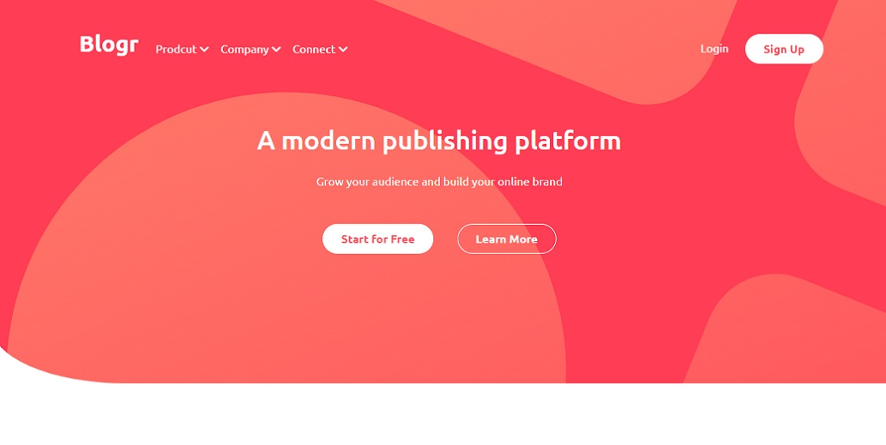

# Frontend Mentor - Blogr landing page solution
 
This is my 4ª project for Frontend Mentor.
Blogr website, built using HTML, CSS, Bootstrap and JavaScript. This was a great challenge where I could improve my knowledge of web development. 
Thanks, Frontend Mentor.

## Note
This is a solution to the [Blogr landing page challenge on Frontend Mentor](https://www.frontendmentor.io/challenges/blogr-landing-page-EX2RLAApP). Frontend Mentor challenges help you improve your coding skills by building realistic projects. 

## Table of contents

- [Frontend Mentor - Blogr landing page solution](#frontend-mentor---blogr-landing-page-solution)
  - [Note](#note)
  - [Table of contents](#table-of-contents)
  - [Overview](#overview)
    - [The challenge](#the-challenge)
    - [Screenshot](#screenshot)
    - [Links](#links)
  - [My process](#my-process)
    - [Built with](#built-with)
    - [Useful resources](#useful-resources)
  - [Author](#author)
  - [Acknowledgments](#acknowledgments)

## Overview

### The challenge

Users should be able to:

- View the optimal layout for the site depending on their device's screen size
- See hover states for all interactive elements on the page

### Screenshot

### Links

- Solution URL: [Add solution URL here](https://your-solution-url.com)
- Live Site URL: [Live website URL here](https://frontend-mentor-blogr-page.netlify.app/)

## My process

### Built with

- Semantic HTML5 markup
- CSS custom properties
- JavaScript
- Bootstrap
- CSS Grid
- Mobile-first workflow

### Useful resources

- [Stack Overflow](https://stackoverflow.com/) 
- [W3schools](https://www.w3schools.com/) 

## Author

- Website - [Pedro Cristo](https://pedro-portfolio-website.netlify.app/)
- Frontend Mentor - [@Pcristo](https://www.frontendmentor.io/profile/Pcristo)
- Linkedin - [Pedro Cristo](https://www.linkedin.com/in/pedro-cristo/)

## Acknowledgments

This is where you can give a hat tip to anyone who helped you out on this project. Perhaps you worked in a team or got some inspiration from someone else's solution. This is the perfect place to give them some credit.

